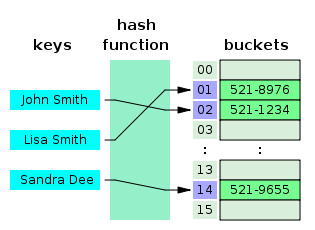

# 해시테이블

---
## 개념
#### [ Key, Value ]로 데이터를 저장하는 자료구조
    - Key는 중복 불가능, Value는 가능
    - 빠른 데이터 조회 가능
        * 내부적으로 배열(버킷)을 사용해 데이터를 저장하기 때문
        * 각각의 Key 값에 해시 함수를 적용해 배열의 고유 index 생성, 이를 활용해 데이터 저장 및 조회
        * 버킷/슬롯: 실제 값이 저장되는 장소
    - 해시 테이블의 평균 시간 복잡도: O(1)



### Hash Function (해시 함수)의 종류
    - Division Method: 나눗셈 이용, (주소) = (입력 값) % (테이블 크기)
        * 테이블 크기를 소수로 정하고 2의 제곱수와 먼 값을 사용해야 효과가 좋음
    - Digit Folding: 각 Key의 문자열을 ASCII 코드로 변환 후 값을 합한 데이터를 테이블 내 주소로 사용
    - Multiplication Method: 숫자인 Key값 K, 0~1 사이 실수인 A, 2의 제곱수인 m을 사용해 특정 계산을 사용
        * h(k) = (kAmod1) * m
    - Univeral Hashing: 다수의 해시 함수를 만들어 집합 H에 넣고, 무작위로 해시 함수 선택해 해시 값 생성 

[//]: # (나머지 개념 정리)

<br/>

## [JAVA] HashMap
HashMap은 JAVA의 Map 인터페이스를 구현한 형태
### 사용법
```java
// 삽입
public V get(Object key)

// 값 조회
public V get(Object key)
public V getOrDefault(Object key, V defaultValue)

// 해당 Key에 해당되는 값이 있는지 조사하여 결과 값 반환
public boolean containsKey(Object key)

// 값 삭제 후 반환
public V remove(Object key)

// 맵의 모든 Key를 Set으로 반환
public Set<K> keySet()
```


### HashTable vs HashMap
```java
// HashTable put
public synchronized V put(K key, V value)

// HashMap put
public V put(K key, V value)
```

|             | HashTable | HashMap |
|-------------|-----------|---------|
| Thread-safe | O         | X       |
| Nullable    | X         | O       |
| Enumeration | O         | X       |
| 보조 해시 함수    | X         | O       |
| 지속적인 개선     | X         | O       |
- 가장 큰 것은 동기화의 여부
- 보조 해시 함수를 사용하면 해시 충돌(Hash collision)의 발생 가능성을 감소


<br/>

## Reference
- https://mangkyu.tistory.com/102
- https://devlog-wjdrbs96.tistory.com/253