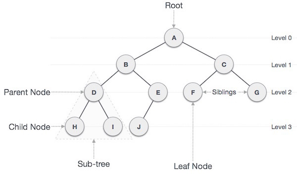
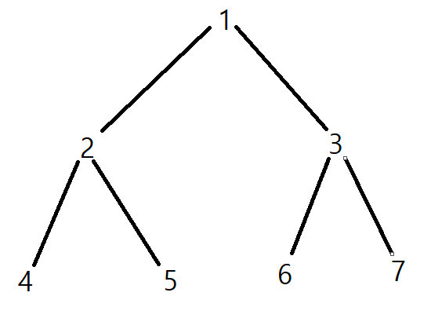

# 트리 뽀개기

---

## 개념
#### 비선형 자료구조 중 하나이며 계층적 형태를 띰  
    - 노드(node)와 노드를 연결하는 간선(edge)로 구성됨
    - 하나 이상의 루트 노드를 가짐
    - 루트 노드는 0개 이상의 자식 노드를 가짐
    - 자식 노드는 0개 이상 자식 노드를 갖고 있으며, 반복적으로 정의됨

### 트리 관련 용어

| 개념                     | 정의                             |
|------------------------|--------------------------------|
| 루트 노드(root node)       | 부모 없는 노드, 트리는 하나의 루트 노드만 가짐    |
| 단말 노드(leaf node)       | 자식 없는 노드, 말단/잎 노드라고도 불림        |
| 내부 노드(internal node)   | 단말 노드가 아닌 나머지 노드               |
| 간선(edge)               | 노드의 연결 선, link/branch 라고도 불림   |
| 형제(sibling)            | 같은 부모를 가지는 노드 (같은 레벨의 노드)      |
| 노드의 크기(size)           | 자신 포함한 모든 자손 노드의 개수            |
| 노드의 깊이(depth)          | 루트에서 어떤 노드의 도달하기까지의 간선 수       |
| 노드의 레벨(level)          | 트리의 특정 깊이를 가지는 노드의 집합          |
| 노드의 차수(degree)         | 하위 트리 개수 / 간선수 = 각 노드가 가진 가지 수 |
| 트리의 차수(degree of tree) | 트리의 최대 차수                      |
| 트리의 높이(height)         | 루트 노드에서 가장 깊숙히 있는 노드의 깊이       |

### 특징
    - 그래프의 한 종류, '최소 연결 트리'
    - 노드가 n개인 트리는 항상 (n-1)개의 간선을 가짐
        * 간선은 항상 (정점의 개수 - 1)만큼 가짐
    - 루트에서 어떤 노드로 가능 경로는 유일
        * 임의의 두 노드 간 경로도 유일, 두 개의 정점 사이에는 반드시 1개의 경로
 

## 트리의 종류
### 이진트리

    - 각 노드가 최대 2개의 자식을 갖는 트리
    - 순회 방식은 전위 순회(pre-order), 중위 순회(in-order), 후위 순회(post-order)로 구성
        * 전위 순회: 루트 노드 -> 왼쪽 하위 -> 오른쪽 하위 (1-2-4-5-3-6-7)
        * 중위 순회: 왼쪽 가장 하위 노드 -> 바로 상위 노드 -> 오른쪽 하위 (4-2-5-1-6-3-7)
        * 후위 순회: 왼쪽 가장 하위 노드 -> 오른쪽 하위 노드 -> 바로 상위 노드 (4-5-2-6-7-3-1)

<a href="../src/tree/BinaryTree.java">🔗 예제 코드 바로가기</a>

 

## 관련 문제
- 트리 순회 [ https://www.acmicpc.net/problem/1991 ]
- 참고 [ https://hello70825.tistory.com/164 ]

 

## Reference

- https://gmlwjd9405.github.io/2018/08/12/data-structure-tree.html
- https://readerr.tistory.com/m/35