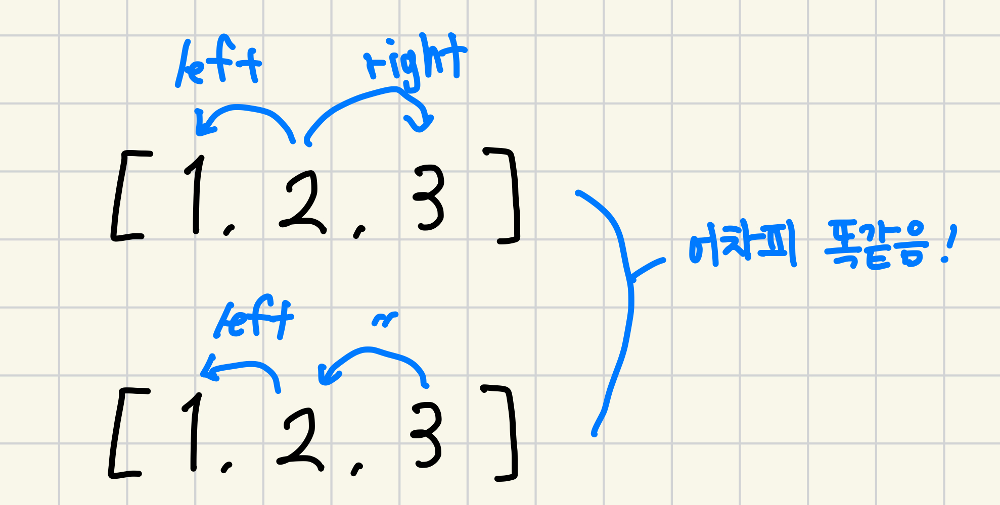

# 극장 좌석

### 문제 설명
[[ 문제 바로가기 ]](https://www.acmicpc.net/problem/2302)

좌석 n개가 있을 때, 좌석에 앉을 수 있는 경우의 수를 구하는 문제  
대신 아래 두 조건을 만족하는 경우여야 함  
```
1. VIP 회원은 반드시 자기 좌석에 앉아야 함
2. 일반 회원은 자기 좌석의 좌/우로만 이동 가능
```

### 풀이
나는 문제를 두 부분으로 나누어서 생각함
```
1. (VIP 좌석이 없다고 가정하고) 좌석에 앉은 경우의 수를 구하는 방법
2. VIP 좌석 처리
```
점화식 도출은.. 언제나 어렵다..  
우선, 일반 회원은 자기 좌석의 좌/우로 밖에 움직이지 못함  
그렇기 때문에 항상 맞닿은 두 개의 좌석(인덱스)만 변경이 가능하며, 변경하려는 좌석에 맞닿은 좌석이 이미 변경되어 있다면 좌석을 변경하지 못함
```
[2,1,3] -> ok
[2,3,1] -> nope! 1<->3은 좌석을 변경하지 못함
```
그래서 결론은 현재 좌석(n)과 왼쪽 좌석(n - 1)이 좌석을 바꿨는지만 생각하면 된다~  



이 점 유의하면서 단순 대입하면..
f(1) = 1 [`1`]
f(2) = 2 [`1,2`, `2,1`]  
f(3) = 3 [`1,2,3`, `1,3,2`, `2,1,3`]
f(4) = 5 [`1,2,3,4`, `1,2,4,3`, `2,1,3,4`, `2,1,4,3`, `1,3,2,4`]

이렇게 결과가 나오고 점화식은 아래가 나옴
```
f(n) = f(n - 1) + f(n - 2)
```
피보나치 수열 dp 참 많이 나오는 듯..

다음 문제는 VIP 처리..  
내 경우엔 VIP 좌석을 기준으로 좌석을 나누고 그 좌석들의 경우의 수들을 곱하여 답을 도출함

```java
import java.io.*;

public class Baekjoon_2302 {
    static long[] dp;
    static int n;

    public static void main(String[] args) throws IOException {
        BufferedReader br = new BufferedReader(new InputStreamReader(System.in));
        n = Integer.parseInt(br.readLine());
        int m = Integer.parseInt(br.readLine());
        boolean[] arr = new boolean[41];
        dp = new long[41];
        for (int i = 0; i < m; i++) {
            arr[Integer.parseInt(br.readLine())] = true;
        }
        br.close();

        dp[0] = dp[1] = 1;
        dp[2] = 2;
        int startIdx = 1; // 배열의 길이를 계산하기 위함
        long cnt = 1;
        for (int i = 1; i <= n; i++) {
            if (arr[i]) {
                cnt *= search(i - startIdx);
                startIdx = i + 1;
            }
        }
        cnt *= search(n - startIdx + 1);
        System.out.println(cnt);
    }

    public static long search(int n) {
        if (dp[n] != 0) return dp[n];
        return dp[n] = search(n - 1) + search(n - 2);
    }
}
```


