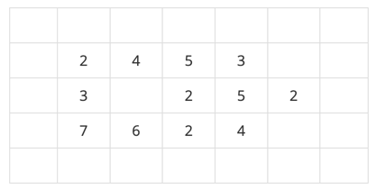
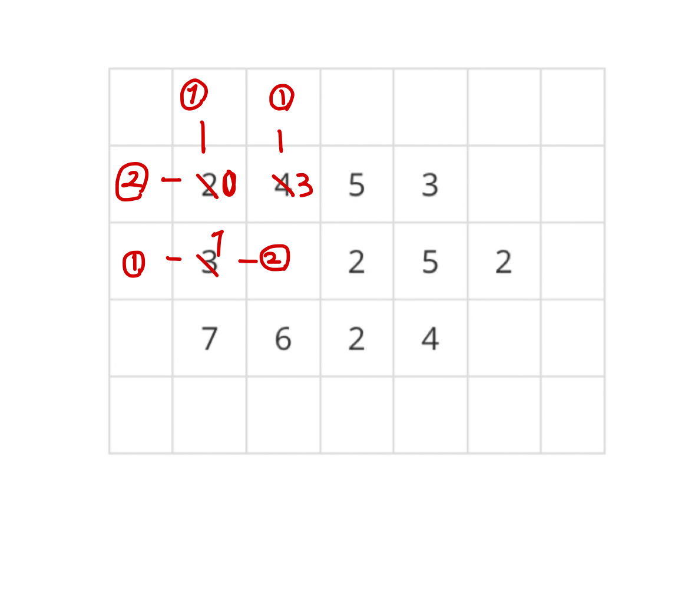
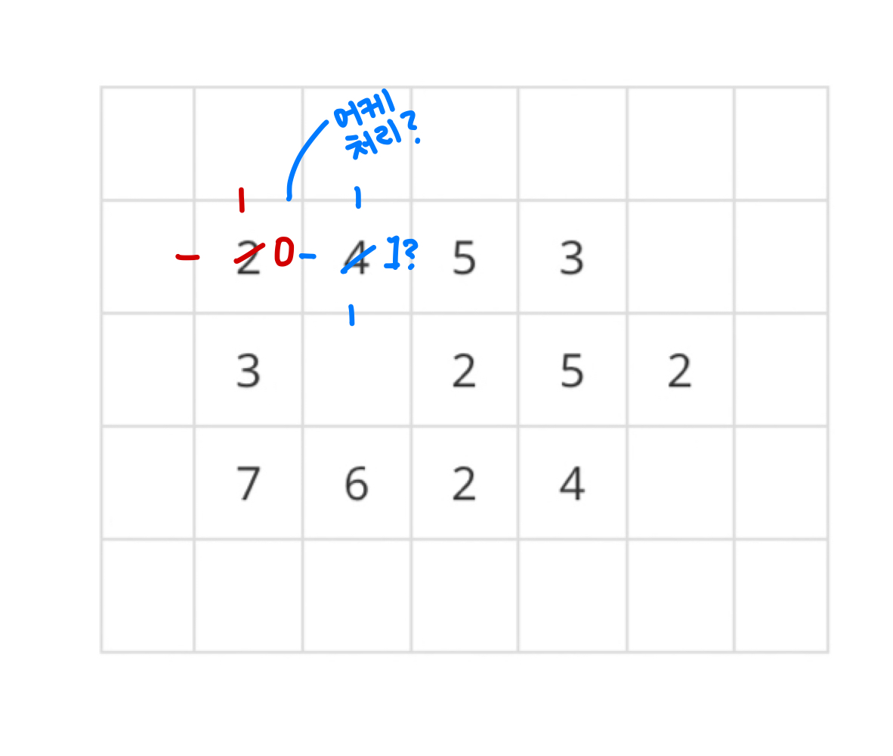
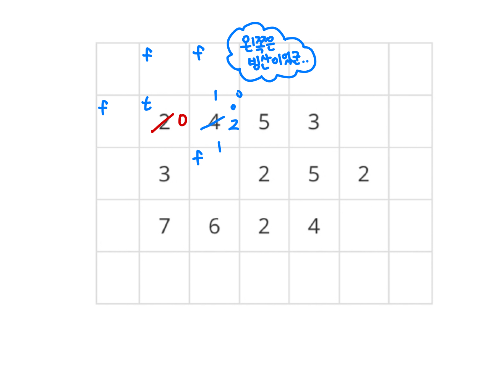
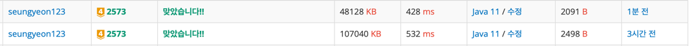

# 빙산

### 문제 설명
[[ 문제 바로가기 ]](https://www.acmicpc.net/problem/2573)

매년마다 빙산의 높이가 줄어들 때, 빙산이 두 덩이 이상 분리될 때의 년도를 구하는 문제  
이때, 빙산의 높이는 해당 칸의 상하좌우에 바닷물(칸의 값이 0)이 연결된 횟수만큼 줄어듦

문제에도 제시된 예제인데, 아래처럼 초기 빙산 값이 할당되어 있으면  


1년 후에는 아래처럼 변함  


1년마다 빙산 높이가 1씩 줄어드는게 아니라, 상하좌우의 바닷물 개수(0 개수)에 따라 높이가 줄어듦을 유의하자  
(이 부분 제대로 안 읽어서 틀림 ㅎㅎ)

<br/>

### 풀이
```
1. 배열을 전체 탐색하면서 빙산을 발견하면 BFS 탐색 진행
2. BFS 탐색을 진행하면서 빙산을 녹임
3. BFS 탐색이 끝났다면 현재 빙산의 개수를 나타내는 변수를 증가시킴
4. 배열 전체 탐색이 끝났을 때, 조건에 따라 종료시키거나 무한 반복함
    4-1. 빙산의 개수가 0임 -> 빙산이 다 녹았으므로 0을 출력하고 종료
    4-2. 빙산의 개수가 2개 이상 -> 출력 조건을 만족하므로 현재 년도를 출력하고 종료
```

이 문제의 관건은 빙산의 높이를 녹일 때의 값을 어떻게 처리할 것이냐에 달린 것 같음  
아무런 처리 없이 순서대로 빙산을 녹이게 된다면, 같은 년도에 녹인 빙산도 바닷물로 처리되어 연산하기 때문임


그래서 나는 녹아야 할 빙상 높이를 계산할 때, 방문하지 않은 바닷물 값만 카운트해서 값을 반환함  
이번 년도에 방문을 했다는 것은 녹는 연산을 진행 전에는 빙산이었다는 것이기 때문에 이를 제외했음


#### BFS 풀이
```java
public class Baekjoon_2573 {
    static int[][] arr;
    static int[] dx = {0, 0, -1, 1};
    static int[] dy = {1, -1, 0, 0};
    static boolean[][] visited;
    static int n, m;

    public static void main(String[] args) throws IOException {
        BufferedReader br = new BufferedReader(new InputStreamReader(System.in));
        StringTokenizer st = new StringTokenizer(br.readLine());
        n = Integer.parseInt(st.nextToken());
        m = Integer.parseInt(st.nextToken());
        arr = new int[n][m];
        for (int i = 0; i < n; i++) {
            st = new StringTokenizer(br.readLine());
            for (int j = 0; j < m; j++) {
                arr[i][j] = Integer.parseInt(st.nextToken());
            }
        }
        br.close();

        int year = 0; // 년도
        while (true) {
            int iceBurgCnt = 0; // 나눠진 빙산의 개수
            visited = new boolean[n][m];
            for (int i = 1; i < n - 1; i++) {
                for (int j = 1; j < m - 1; j++) {
                    // 방문하지 않았고(올해에 빙산이 녹지 않았고) 빙산의 높이가 1 이상인 경우 bfs 순회
                    if (!visited[i][j] && arr[i][j] > 0) {
                        bfs(i, j);
                        iceBurgCnt++;
                    }
                }
            }

            if (iceBurgCnt == 0) {
                // 나눠진 빙산의 개수가 0개이다 => 모든 빙산이 다 녹았다
                System.out.println(0);
                return;
            }
            if (iceBurgCnt >= 2) {
                // 나눠진 빙산의 개수가 2개 이상일 때는 현재 년도 값을 출력
                System.out.println(year);
                return;
            }
            year++;
        }
    }

    public static void bfs(int x, int y) {
        Queue<Point> q = new LinkedList<>();
        q.offer(new Point(x, y));
        visited[x][y] = true;
        while (!q.isEmpty()) {
            Point cur = q.poll();
            arr[cur.x][cur.y] -= getMeltingCount(cur.x, cur.y);

            for (int i = 0; i < 4; i++) {
                int ax = cur.x + dx[i];
                int ay = cur.y + dy[i];
                if (!visited[ax][ay] && arr[ax][ay] > 0) {
                    visited[ax][ay] = true;
                    q.offer(new Point(ax, ay));
                }
            }
        }
    }

    // 녹아야 할 빙산의 높이를 반환
    public static int getMeltingCount(int x, int y) {
        int cnt = 0;
        for (int i = 0; i < 4; i++) {
            int ax = x + dx[i];
            int ay = y + dy[i];
            // visited 했다는 것은 빙산이 있었던 곳
            // 올해에 빙산이 모두 녹았을 수도 있으므로, 올해에 빙산이 있었던 곳은 제외하고 계산
            if (!visited[ax][ay] && arr[ax][ay] <= 0) {
                cnt++;
            }
        }
        return cnt;
    }

    static class Point {
        int x, y;

        Point(int x, int y) {
            this.x = x;
            this.y = y;
        }
    }
}

```

#### DFS 풀이
나머지 코드는 다 똑같고 탐색 부분만 다름
```java
public static void dfs(int x, int y) {
    visited[x][y] = true;
    arr[x][y] -= getMeltingCount(x, y);

    for (int i = 0; i < 4; i++) {
        int ax = x + dx[i];
        int ay = y + dy[i];
        if (!visited[ax][ay] && arr[ax][ay] > 0) {
            dfs(ax, ay);
        }
    }
}
```

아래서부터 차례대로 BFS/DFS 결과값
